# 功能设计

截图放在 screenshots/ 目录下。

---

## 1. 启动界面

程序启动时显示品牌启动屏，3.2 秒后自动进入主界面。

## 2. 主界面

Ribbon 工具栏在上，左侧数据面板，中间地图，右侧面板，底部状态栏。

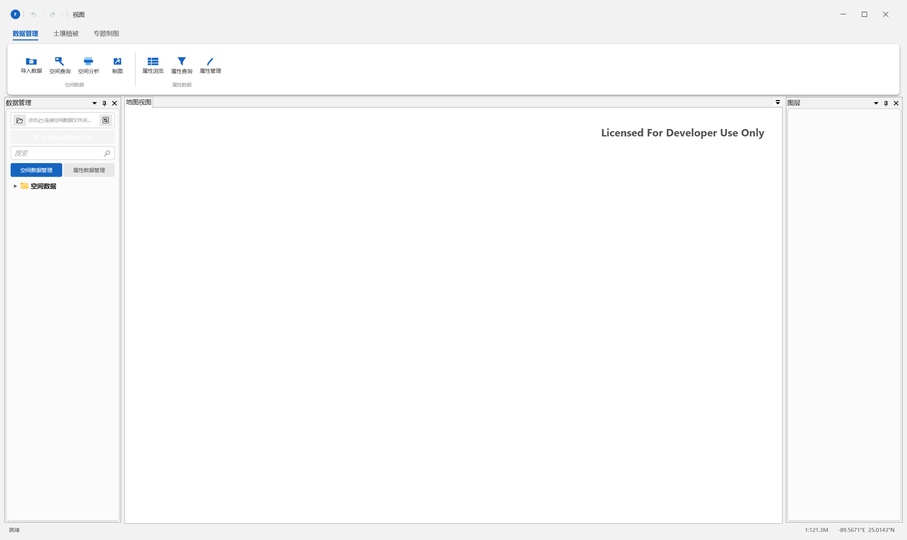

## 3. 数据管理面板

左侧面板，连接本地空间数据文件夹后展示目录树。双击SHP加载到地图，右键菜单操作。

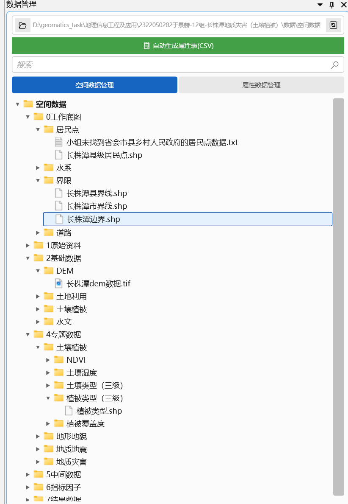

## 4. 图层面板

管理已加载图层。每行含复选框、名称、符号色块。悬停浅蓝底，选中深蓝边框。

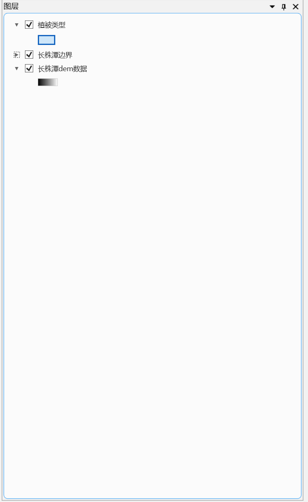

## 5. 符号系统面板

编辑图层渲染样式。单一符号可调填充色/透明度/轮廓色。按字段配色选字段和色带自动渲染。

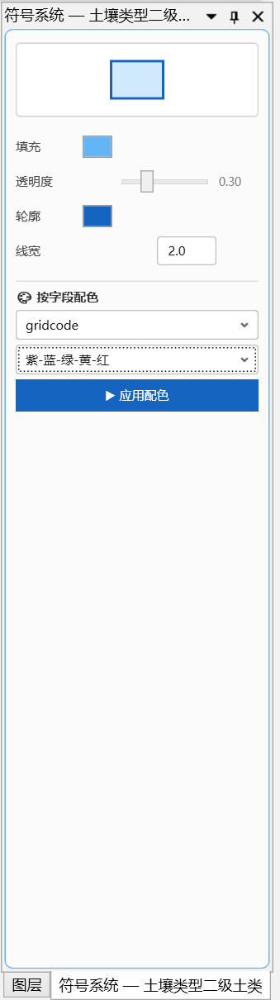

## 6. 地理分析面板

五个分析模块共用。选分类面图层和灾害点图层，选字段，运行分析，输出CF值统计表和图表。

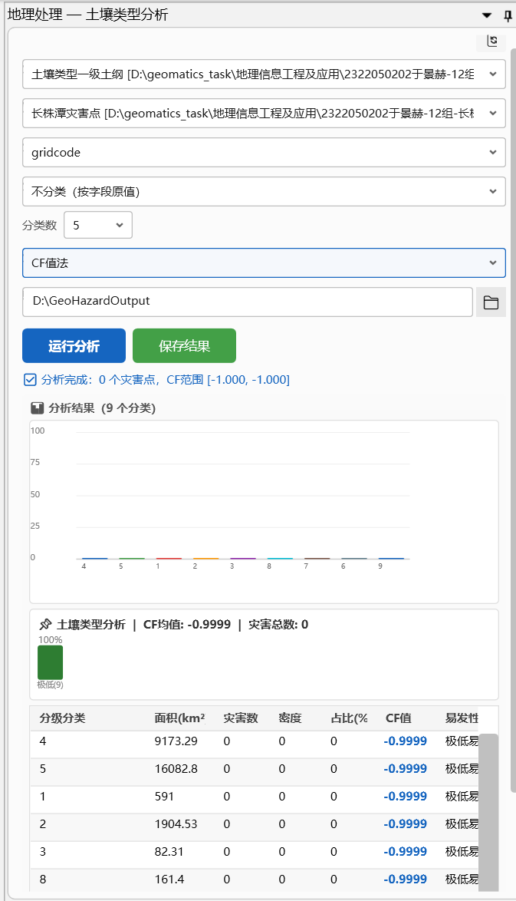

## 7. 属性浏览

选图层即可查看属性表，支持复制选中行和导出CSV。

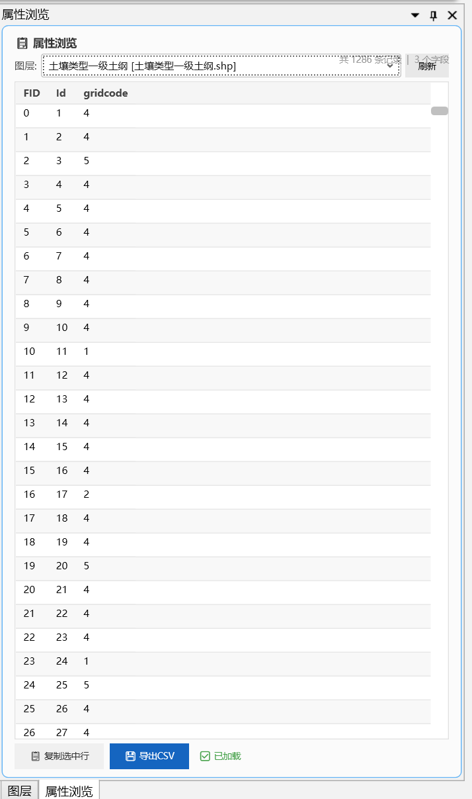

## 8. 属性编辑

可编辑DataGrid直接修改属性值，保存写回SHP文件。支持添加字段和撤销修改。

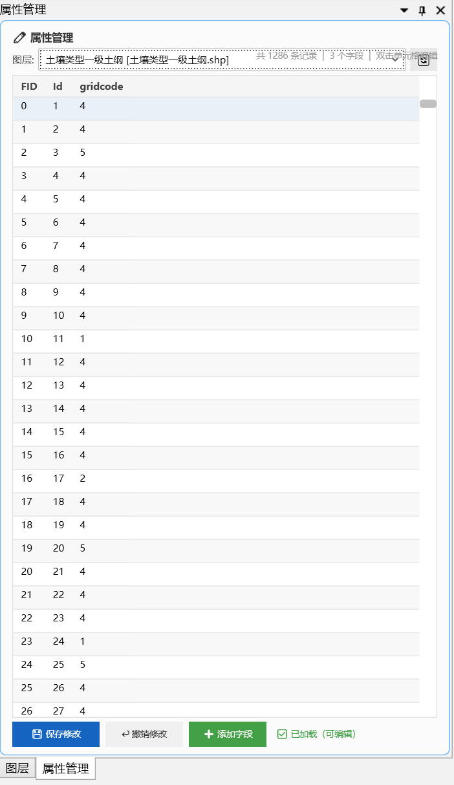

## 9. 属性查询

按条件查询属性表，支持等于、不等于、模糊匹配、大于、小于等运算符。

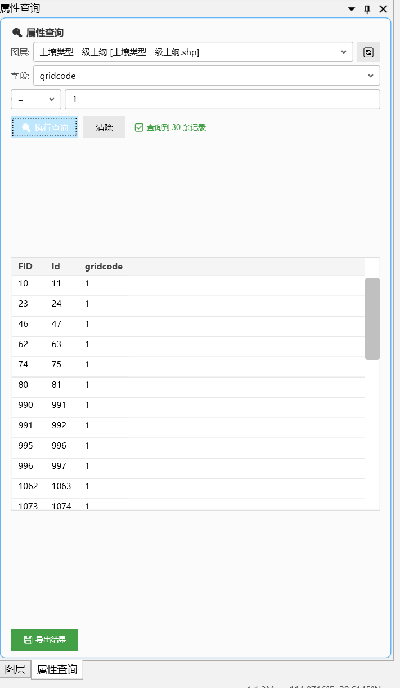

## 10. 空间查询

两个图层之间的空间关系查询，支持相交和完全包含两种方式。

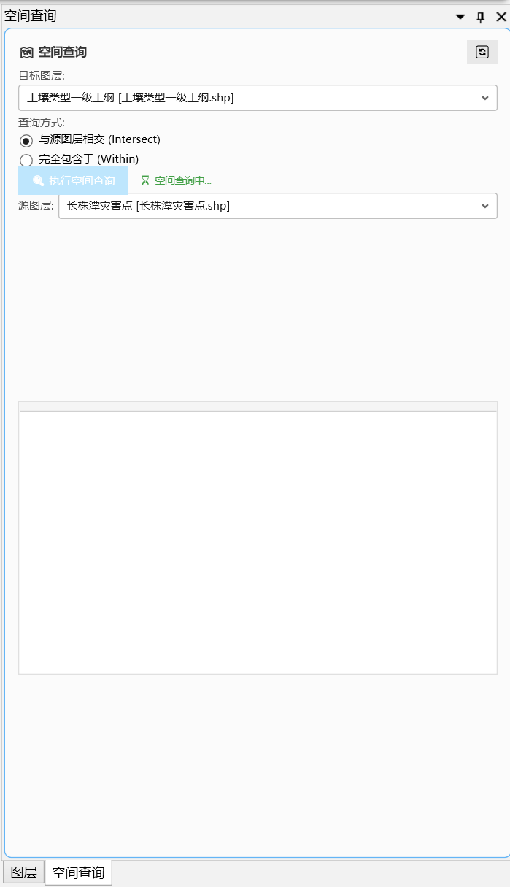

## 11. 专题制图

选图层、输图名、刷新底图。画布上自动生成地图底图、真实图例、比例尺、指北针，均可鼠标拖动定位，最后生成PNG。

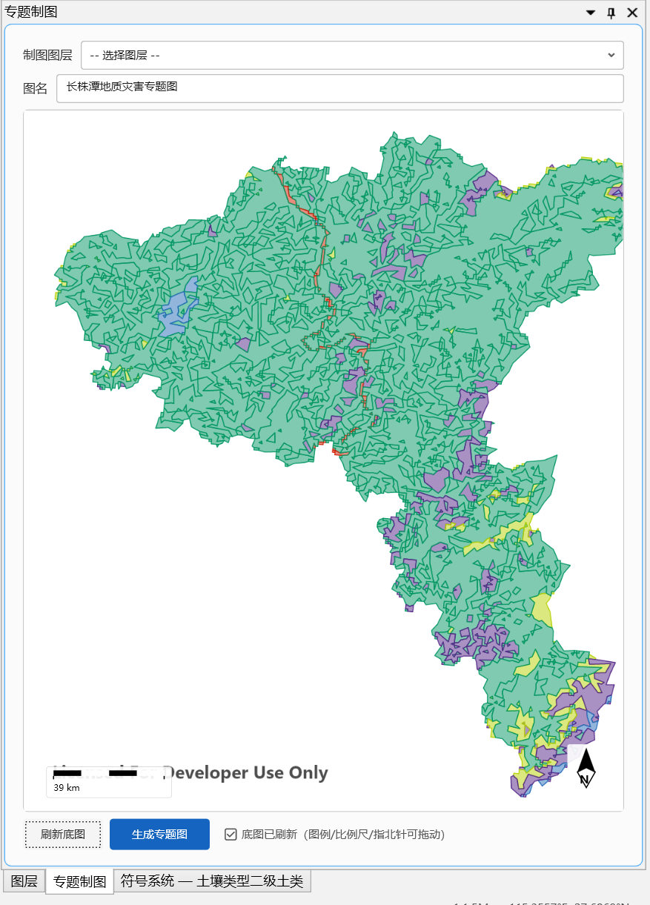

## 12. 统计图查看

浏览分析输出的PNG统计图，缩略图预览，点击打开原图。

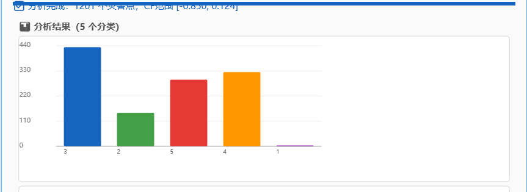

## 13. 统计表查看

浏览分析输出的CSV统计表，点击在DataGrid中预览内容。

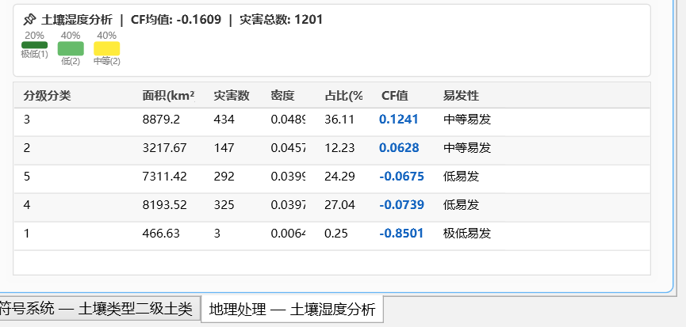

## 14. 视图菜单

标题栏视图下拉菜单，切换四个面板和地图视图的显隐状态。

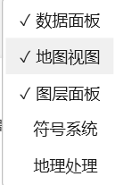

## 15. 状态栏

实时显示操作状态、地图比例尺和鼠标所在位置的经纬度坐标。

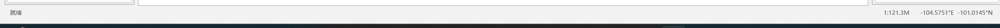
